# GitHub Workflow

This guide explains how we use GitHub for collaboration, project management, and code reviews. It covers the key principles of our workflow: managing issues, creating branches, making commits, and submitting pull requests (PRs).

The document provides a complete overview of how to work with our GitHub template, including best practices for handling issues, reviewing code, and contributing to project development.

## Issues

A GitHub issue is a way to track work, bugs, tasks, or feature requests in a repository. It provides a centralized place to plan, discuss, assign, and manage work. You can organize work hierarchically by creating a parent Issue for a larger task and linking sub-issues for smaller, related tasks. This allows you to easily track progress and browse the full hierarchy of work to be done.

## Issue Hierarchy

Our workflow follows a three-tier hierarchy for better organize and manage work:


**Hierarchy Overview:**
```
Epic → Feature → Task
```

### Issue Templates
Each repository will be configured with Issue templates of these main types: Epic, Feature, Task, and Bug. The following sections explain all the Issue templates, their contents, and how to use them effectively.

#### Epic Template
- **Purpose**: Large-scale business initiatives spanning multiple months/quarters
- **Scope**: Contains multiple features and defines strategic direction
- **Owner**: Product managers, team leads, stakeholders
- **Template Content**:
  - **Title**: A concise summary of the feature, clearly stating what it will do.
  - **Pre-submission Checklist**: Items to verify before submitting the feature for development, ensuring completeness and clarity.
  - **Business Priority**: The importance of this feature for the business, e.g., High, Medium, or Low, and why it matters.
  - **Epic Vision**: The overall strategic goal or purpose this Epic contributes to within the product roadmap.
  - **Problem Statement**: A clear description of the problem(s) the Epic is solving.
  - **Success Criteria**: Measurable outcomes or conditions that indicate the Epic has achieved its goals.
  - **Target Users / Personas**: Primary users who will benefit from this Epic, including relevant personas.
  - **Scope**: Defines what is in and out of scope for the Epic, setting boundaries for planning.
  - **Expected Feature / Deliverable**: High-level description of the features or functionality the Epic will deliver.
  - **Estimated Timeline**: Rough estimate of completion time, often broken down by phases or milestones.
  - **Team Size Required**: Number of team members needed to execute the Epic successfully.
  - **Dependencies & Blockers**: Other Epics, features, or external factors that may affect progress or prevent completion.
  - **Key Assumptions**: Assumptions made during planning or design that could impact the Epic's implementation.

#### Feature Template
- **Purpose**: Specific functionality within an epic
- **Scope**: Individual user-facing capabilities or system components
- **Owner**: Developers, designers, product owners
- **Template Content**:
  - **Title**: A concise summary of the feature, clearly stating what it will accomplish.
  - **Priority**: The importance or urgency of this feature (e.g., High, Medium, Low) in the context of business goals.
  - **Problem Statement / Feature Description**: A clear explanation of the problem this feature addresses and what it is intended to do.
  - **Proposed Solution**: The recommended approach to implement the feature, including design or technical considerations.
  - **Alternatives**: Other potential solutions or approaches considered, and reasons for selecting the proposed solution.
  - **Use Cases**: Specific scenarios illustrating how users will interact with the feature.
  - **Acceptance Criteria**: Measurable conditions that define when the feature is complete and successful.
  - **Effort Estimate**: Approximate time, story points, or resources needed to implement the feature.
  - **Component**: The module, system, or part of the product that the feature will affect.

#### Task Template
- **Purpose**: Individual work items that implement features
- **Scope**: Specific development work (API endpoint, UI component, etc.)
- **Owner**: Developers
- **Template Content**:
  - **Title**: A concise summary of the task, clearly stating what needs to be done.
  - **Checklist**: Step-by-step sub-tasks or preconditions to ensure the task is completed systematically.
  - **Priority**: The urgency or importance of the task (e.g., High, Medium, Low) to help with planning and scheduling.
  - **Development Area**: The specific module, component, or part of the system the task relates to.
  - **Task Description**: A detailed explanation of the work to be done, including context and purpose.
  - **Requirements**: Specific conditions, technical specifications, or resources needed to complete the task.
  - **Acceptance Criteria**: Clear, measurable conditions that define when the task is considered complete and successful.
  - **Estimated Effort**: Approximate time, story points, or effort required to complete the task.
  - **Dependencies**: Other tasks, features, or external factors that must be completed or resolved before this task can start.
  - **Additional Context**: Any extra information, notes, or references that help the assignee understand the task fully.

**Tip:** Use the template to make your issue clear and actionable, this helps reviewers and PMs understand your work quickly.

#### Bug Template
- **Purpose**: Issues that need fixing
- **Scope**: Problems in existing functionality
- **Owner**: Developers, QA team
- **Template Content**:
  - **Title**: A concise summary of the bug or issue.
  - **Description**: A detailed explanation of the problem, including what is happening and any relevant context.
  - **Steps to Reproduce**: Step-by-step instructions to recreate the issue reliably.
  - **Expected vs Actual**: What you expected to happen versus what actually occurred.
  - **Contact Info**: Person reporting the bug for follow-up or clarification.
  - **Priority**: The urgency or impact of the bug (e.g., High, Medium, Low).
  - **Component**: The part of the system, module, or feature affected.
  - **Environment**: Details about the system environment where the bug occurs (e.g., OS, browser, version).

## Assigning issues and pull requests to other GitHub users

Assignees clarify who is working on specific issues and pull requests.

## Closing an issue

To keep our issue tracker clear and transparent, please follow these rules when closing issues:

- **Closing through a Pull Request:** If an issue is linked in a PR using GitHub keywords such as `Fixes #123` or `Closes #123`, it will be automatically closed once the PR is merged.
- **Manual closing (required action):** If you close an issue without a PR merge, you must leave a comment explaining the reason (e.g., resolved elsewhere, duplicate, or won't fix). Always include enough context so that future readers can understand the decision.

## Configuring issue templates for your repository

Use the templates available in the [docs-template repository](https://github.com/rihal-om/docs-template) to set up standardized issue templates for your repository.

### Issue Workflow

1. Creating issue using a template
2. Filling in information
3. Adding a task list/sub task issues to break down work (optional)
4. Adding labels
5. Adding milestones
6. Assigning the issue
7. Adding the issue to a project
8. Submitting your issue

---

## Labels

Labels let you categorize issues, pull requests, and discussions within a repository. They are repository-specific, so changes don't affect other repos.

GitHub also provides default labels in new repositories to support standard workflows.

### Development Area Labels
- `area: fe` - Frontend (UI, components, client-side logic)
- `area: be` - Backend (Server, APIs, database)
- `area: ml` - Machine Learning (Modeling, feature engineering, evaluation)
- `area: mobile/android` - Work related only to Android applications
- `area: mobile/ios` - Work related only to iOS applications
- `area: mobile/both` - Work related to both Android and iOS applications
- `area: security` - Vulnerabilities, audits, fixes

### Category Labels

- `category: design` - Design, wireframes, mockups
- `category: ci/cd` - Deployment scripts, CI/CD, infrastructure
- `category: documentation` - Writing or updating documentation, guides, READMEs
- `category: chores` - Maintenance, housekeeping, or non-feature work
- `category: refactor` - Code restructuring or improvements without adding new functionality

### Module Labels (Customize for your project)
- `module: auth` - Authentication and authorization
- `module: users` - User management
- `module: api` - API and integration
- `module: dashboard` - Dashboard and analytics

**Note:** Module labels should be customized for each project based on its specific architecture and components.

### Special Labels
- `help wanted` - Extra attention or contributions are needed
- `question` - Used when someone is asking for clarification, guidance, or additional information about the project, feature, or issue.

---

## Branches

Whenever you propose a change in Git, you create a new branch. Branch management is an important part of the Git workflow. After some time, your list of branches may grow, so it's a good idea to delete merged or stale branches.

### Branch Naming

When creating a new branch, follow these conventions:

- If the issue is from GitHub:
  - **Prefix with the issue number**: start the branch name with the related issue ID.
  - **Add a short title**: describe the task or feature briefly.
  - **Use lowercase only**.
  - **Use hyphens (`-`) as separators** to avoid underscores or spaces.
  - **Keep it concise**: 3–5 words, clear and descriptive.

- If the issue is from another platform (e.g., Click Up, Linear, Trello, etc.):
  - First, create a corresponding issue in GitHub.
  - Then, follow the same GitHub branch naming rules as above.

**Examples:**
- `890-fix-api`
- `12-fix-button`
- `567-resolve-crash`

**Why this matters:**
- Easy sorting and organization in Git
- Quick issue lookup and traceability
- Better Git history and navigation
- Automated linking between branches and issues

---

## Commit Messages

Git commits are a way to "record changes to a repository". A well-written commit message makes it easier for everyone to understand what changed and why.

**Format:**
```
<type>(<optional scope>): <short summary>
```

### Types
- `feat` → a new feature
- `fix` → a bug fix
- `docs` → documentation only changes
- `style` → code style/formatting (no logic changes)
- `refactor` → code restructuring without behavior change
- `perf` → performance improvements
- `test` → adding or updating tests
- `chore` → maintenance tasks (build, tooling, configs, etc.)
- `build` → build system changes or external dependencies
- `ci` → CI/CD configuration or scripts
- `revert` → revert a previous commit

### Scope (optional)
Use when the commit affects a specific area, module, or tool. Examples: `web`, `server`, `docker`, `k8s`, `e2e`, `docs`, `ci`, `deps`, `ml`, `keycloak`.

### Summary
- Use the imperative present tense (`add`, `fix`, `update`, `remove`).
- Write in lowercase.
- Keep it short and clear (≤ 72 characters).

### Examples

**Good commit messages:**
```bash
feat(auth): add OAuth2 support (refs #123)
fix(api): resolve timeout issue (fixes #456)
docs: update installation guide (refs #789)
refactor(db): optimize query performance (refs #234)
test(auth): add login integration tests (refs #567)
chore: update dependencies (refs #890)
```

**Bad commit messages:**
```bash
updated code
changes
wip
fix
update
```

### Linking Commits to Issues

Always reference the related issue in your commit message:
- `refs #123` - References the issue
- `fixes #123` - Closes the issue when merged to main
- `closes #123` - Closes the issue when merged to main

---

## Pull Requests

A pull request is to propose and collaborate on changes to a repository. These changes are proposed in a branch, which ensures that the default branch only contains finished and approved work.

### Pull Request Template

A Pull Request template ensures consistency, clarity, and faster reviews. It guides developers to provide all necessary information for reviewers and maintainers.

**Template includes:**
- **Title:** A brief, descriptive summary of the pull request.
- **Description:** Explain what the PR does, why it's needed, and any relevant context.
- **Related Issues:** Link to any related issues, tickets, or Epics.
- **Type of Change:** Specify the type of change (e.g., Bug fix, Feature, Refactor, Documentation).
- **Changes Made:** List the main changes, additions, or deletions introduced by the PR.
- **Testing:** Describe how reviewers can test the changes, including steps or environments.
- **Checklist:** Optional verification items (e.g., code linted, tests passed, documentation updated).
- **Screenshots:** Optional visual aids, logs, or images to clarify the changes.

### PR Requirements
- Keep PRs small and focused on a single task or feature.
- Use clear, concise language in descriptions and titles.
- Link all related issues for traceability.
- Update the PR if changes are requested during review.
- Add appropriate labels.
- Fill out PR template completely.
- Request at least one reviewer.

### PR Checks (Automated)
- Semantic PR title validation
- Commit author validation
- Auto-size labeling based on changes
- Linting and code style checks
- Automated tests
- Build verification

### PR Process
1. Create PR from a feature branch
2. Auto-assigned size label
3. Semantic validation runs
4. Automated checks execute
5. Code review process
6. Address feedback
7. Approval and merge
8. Automatic issue closure (if linked)

## 📝 Pull Request Workflow

```mermaid
flowchart TD
    A["🌿 CREATE FEATURE BRANCH<br/>git checkout -b 123-feature-name"] --> B["⌨️ MAKE CHANGES<br/>Implement Code"]
    B --> C["🔀 CREATE PULL REQUEST<br/>Submit for Review"]
    C --> D["🤖 AUTOMATED CHECKS<br/>CI/CD Pipeline"]
    D --> E{"✅ CHECKS<br/>PASS?"}
    E -->|"❌ Failed"| F["🔧 FIX ISSUES<br/>Resolve Problems"]
    F --> B
    E -->|"✅ Passed"| G["👥 CODE REVIEW<br/>Peer Review"]
    G --> H{"🎯 REVIEW<br/>APPROVED?"}
    H -->|"🔄 Changes Requested"| I["📝 ADDRESS FEEDBACK<br/>Update Code"]
    I --> B
    H -->|"✅ Approved"| J["🚀 MERGE TO MAIN<br/>Deploy Changes"]
    J --> K["🏗️ AUTO-DEPLOY/BUILD<br/>CI/CD Pipeline"]
    K --> L["🏷️ CLOSE RELATED ISSUES<br/>Update Status"]

    classDef branch fill:#2b6cb0,stroke:#63b3ed,stroke-width:2px,color:#fff,font-weight:bold,rx:12,ry:12
    classDef development fill:#805ad5,stroke:#b794f6,stroke-width:2px,color:#fff,rx:10,ry:10
    classDef pr fill:#ed8936,stroke:#fd9547,stroke-width:2px,color:#fff,font-weight:bold,rx:12,ry:12
    classDef automation fill:#319795,stroke:#4fd1c7,stroke-width:2px,color:#fff,rx:10,ry:10
    classDef decision fill:#ecc94b,stroke:#f6e05e,stroke-width:2px,color:#2d3748,font-weight:bold,rx:20,ry:20
    classDef error fill:#e53e3e,stroke:#fc8181,stroke-width:2px,color:#fff,rx:10,ry:10
    classDef feedback fill:#d69e2e,stroke:#f6e05e,stroke-width:2px,color:#2d3748,rx:10,ry:10
    classDef success fill:#38a169,stroke:#68d391,stroke-width:3px,color:#fff,font-weight:bold,rx:15,ry:15
    classDef deploy fill:#4a5568,stroke:#718096,stroke-width:2px,color:#fff,rx:10,ry:10
    classDef close fill:#2f855a,stroke:#68d391,stroke-width:2px,color:#fff,rx:10,ry:10

    class A branch
    class B,I development
    class C pr
    class D,K automation
    class E,H decision
    class F error
    class G feedback
    class J success
    class L close
```



### Linking a pull request to an issue using a keyword

You can link a pull request to an issue by using a supported keyword in the pull request's description or in a commit message.

**Keywords:**
- `close`, `closes`, `closed`
- `fix`, `fixes`, `fixed`
- `resolve`, `resolves`, `resolved`

These can be followed by colons or written in uppercase. For example:
- `Closes: #10`
- `CLOSES #10`
- `CLOSES: #10`

> **Note:** Only manually linked pull requests can be manually unlinked. To unlink an issue that you linked using a keyword, you must edit the pull request description to remove the keyword.

---

## Best Practices Summary

1. **Issue Management**
   - Always create issues before starting work
   - Use appropriate templates (Epic/Feature/Task/Bug)
   - Fill out all required fields completely
   - Link related issues for traceability
   - Keep issues focused and actionable

2. **Branch Management**
   - Always start branch names with issue ID
   - Keep branch names short and descriptive
   - Delete branches after merging
   - Keep branches up to date with main

3. **Commit Practices**
   - Write clear, descriptive commit messages
   - Follow conventional commit format
   - Always reference related issues
   - Make small, focused commits
   - Test before committing

4. **Pull Request Practices**
   - Fill out PR template completely
   - Keep PRs small and focused (< 500 lines preferred)
   - Link to related issues
   - Request appropriate reviewers
   - Respond to feedback promptly
   - Keep PRs up to date with main branch

5. **Code Review**
   - Review within 24 hours when possible
   - Provide constructive feedback
   - Test changes locally if possible
   - Approve or request changes clearly
   - Be respectful and professional

---

## Getting Help

**Resources:**
- [Developer Quick Start Guide](DEVELOPER_GUIDE.md) - Complete setup instructions
- [Developer Checklist](DEVELOPER_CHECKLIST.md) - Daily workflow checklist
- [Quick Reference](QUICK_REFERENCE.md) - One-page cheat sheet
- [Workflow Examples](WORKFLOW_EXAMPLES.md) - Real-world examples
- [Project Board Setup](PROJECT_BOARD_SETUP.md) - Project board configuration

**Support:**
- Contact @Hanzla or @Amna for workflow questions
- Join the workflow discussion channel
- Check GitHub Discussions for common questions

---

**Last Updated:** 2025-01-15
**Version:** 1.0
**Maintained by:** Hanzla & Amna
