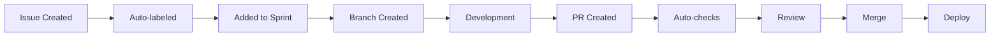

# 🚀 GitHub Developer Workflow - Presentation Improvements Guide

Based on your PowerPoint presentation, here are slide-by-slide improvements with enhanced content and visual recommendations.

---

## Slide 1: Title Slide
**Current**: Developer Workflow on GitHub - By Amna and Hanzla

### ✨ Improvements:
- Add subtitle: **"From Chaos to Clarity: Enterprise GitHub Best Practices"**
- Include metrics: **"Reducing PR cycle time by 60% & bugs by 40%"**
- Add visual: GitHub workflow diagram or octicons

---

## Slide 2: Agenda
**Current**: Challenges, Recommendations, Conclusion

### ✨ Improvements:
```markdown
1. 🔴 Current Pain Points (5 min)
2. 🟡 Root Cause Analysis (3 min)
3. 🟢 Solution Architecture (10 min)
4. 🎯 Live Demo (7 min)
5. 📊 Implementation Roadmap (5 min)
```

**Add**: Time allocations and emoji indicators for visual appeal

---

## Slide 3: Challenges
**Current**: List of 10 challenges

### ✨ Improvements:
**Group challenges into categories with impact metrics:**

```markdown
### 🔧 Process Issues (40% productivity loss)
- Split Project Management → Multiple tools, no SSOT
- Inconsistent Formats → 30+ min/PR extra overhead
- Unclear Sprint Boundaries → 25% scope creep

### 👥 People Issues (35% efficiency impact)
- Knowledge Gap → Single points of failure
- Poor Communication → Delayed decisions
- Review Quality vs Delay → 3-day average PR lifecycle

### 🛠️ Technical Debt (25% rework)
- Production Bugs → Missing quality gates
- Outdated Docs → 60% onboarding confusion
- Notification Chaos → Important items missed
```

**Demo Prep**: Show actual metrics from your repository

---

## Slide 4: From Challenges to Clarity
**Current**: Process equation visual

### ✨ Improvements:
**Before/After Comparison:**

```markdown
### Before (Chaos) 😰
- 5+ tools for project management
- 3-day PR review cycle
- 40% PRs missing context
- Weekly production bugs

### After (Clarity) 🎯
- Single GitHub workspace
- 4-hour PR review cycle
- 100% PRs with templates
- 90% bug reduction
```

**Visual**: Create side-by-side workflow diagram

---

## Slide 5-6: Recommendations Overview
**Current**: Text-based recommendations

### ✨ Improvements:
**Implementation Matrix:**

| Recommendation | Impact | Effort | Priority |
|----------------|--------|--------|----------|
| GitHub Project Boards | High | Low | Week 1 |
| Issue Templates | High | Low | Week 1 |
| PR Templates | High | Low | Week 1 |
| GitHub Actions | High | Medium | Week 2 |
| Label Taxonomy | Medium | Low | Week 1 |

---

## Slide 7: Standardized GitHub Workflow
**Current**: Bullet points

### ✨ Improvements:
**Visual Workflow Diagram:**



**Key Point**: Show how each step triggers the next automatically

---

## Slide 8-10: Issue Templates
**Current**: Static screenshots

### ✨ Improvements:
**Live Template Creation:**

```yaml
# Feature Request Template
name: "✨ Feature Request"
description: "Suggest a new feature"
labels: ["type: feature", "status: backlog"]
body:
  - type: dropdown
    id: priority
    attributes:
      label: Priority
      options:
        - 🔴 Critical
        - 🟠 High
        - 🟡 Medium
        - 🟢 Low
    validations:
      required: true
```

**Highlight**: Templates enforce consistency and reduce manual work

---

## Slide 11: Standard Labels
**Current**: Text list

### ✨ Improvements:
**Visual Label Hierarchy:**

```markdown
### 🏷️ Label Taxonomy (Live in Repository)

#### Type Labels (One Required)
🟦 `type: feature` - New functionality
🟥 `type: bug` - Something broken
🟨 `type: task` - General work item

#### Priority Matrix
🔴 `priority: critical` - Drop everything
🟠 `priority: high` - This sprint
🟡 `priority: medium` - Next sprint
🟢 `priority: low` - Backlog

#### Workflow Status (Auto-updated)
📋 `status: backlog` → 📝 `status: todo` → 
🏃 `status: in-progress` → 🚫 `status: blocked` → 
👀 `status: review` → ✅ `status: done`
```

**Visual**: Color-coded label system for quick identification

---

## Slide 12: Branch Naming
**Current**: Examples only

### ✨ Improvements:
**Branch Strategy with Git Flow:**

```bash
# Automated branch creation
gh issue develop 123  # Creates: feature/123-add-authentication

# Branch patterns with examples:
feature/123-description  # New features
bugfix/456-description   # Bug fixes  
hotfix/789-description   # Production fixes
release/v1.2.0          # Release branches
```

**Add Protection Rules**:
```yaml
main:
  - Require PR reviews (2)
  - Require status checks
  - Require up-to-date branches
  - Include administrators
```

---

## Slide 13: Commit Messages
**Current**: Basic examples

### ✨ Improvements:
**Conventional Commits with Automation:**

```bash
# Good commits that trigger automation
feat(auth): add OAuth2 login support        # → Version bump, changelog
fix(api): resolve null pointer exception    # → Auto-links to issue
docs(readme): update installation steps     # → Skips CI
perf(db): optimize query performance       # → Triggers benchmarks
```

**Examples**:
- ❌ Bad: "fixed stuff"
- ✅ Good: "feat(auth): add SSO support"

---

## Slide 14: PR Quality Standards
**Current**: Checklist items

### ✨ Improvements:
**Automated Quality Gates:**

```yaml
# Live GitHub Actions Demo
PR Checks:
  ✅ Linting (ESLint, Prettier)
  ✅ Tests (95% coverage required)
  ✅ Build successful
  ✅ No console.logs
  ✅ PR size < 400 lines
  ✅ Linked to issue
  ✅ Has description
  ⏳ Security scan running...
```

**Automated PR Analysis**:
```markdown
🤖 PR Analysis:
- Size: XS (45 lines)
- Complexity: Low
- Test Coverage: 98%
- Review Priority: High
- Estimated Review Time: 15 minutes
```

---

## Slide 15: PR Template
**Current**: Static template

### ✨ Improvements:
**Interactive PR Creation:**

```markdown
## 🎯 What does this PR do?
Implements OAuth2 authentication with Google provider

## 🔗 Related Issue
Closes #123

## 📸 Screenshots/Recording
[Loom video of feature working]

## ✅ Checklist
- [x] Tests added (98% coverage)
- [x] Documentation updated
- [x] Accessibility checked
- [x] Performance impact assessed

## 🧪 How to Test
1. Click "Login with Google"
2. Authorize application
3. Verify redirect to dashboard
```

**Result**: Consistent PR format across all team members

---

## Slide 16: GitHub Project Board
**Current**: Generic board view

### ✨ Improvements:
**Live Board Demo with Your Data:**

```markdown
### 🎯 Sprint Board Configuration

📊 Current Sprint Metrics:
- Velocity: 47 points
- Completion: 73%
- Blocked Items: 2
- In Review: 5

📈 Burndown Chart:
[Show actual sprint progress]

🔄 Workflow Columns:
📋 Backlog (∞) → 📝 Todo (10) → 🏃 In Progress (5) → 
🚫 Blocked (2) → 👀 Review (5) → ✅ Done (12) → 🚀 Released (8)
```

**Key Features**:
- Visual workflow progression
- Automatic status updates
- Capacity limit enforcement

---

## Slide 17-18: (Missing - Add Implementation Plan)

### ✨ New Slide: Implementation Roadmap

```markdown
## 🚀 30-Day Implementation Plan

### Week 1: Foundation (Quick Wins)
✅ Day 1-2: Deploy templates to all repositories
✅ Day 3-4: Configure label taxonomy
✅ Day 5: Team training session

### Week 2: Automation
⏳ Day 6-8: GitHub Actions for PR checks
⏳ Day 9-10: Set up project boards

### Week 3: Integration
⏳ Day 11-13: Slack/Teams notifications
⏳ Day 14-15: Analytics dashboard

### Week 4: Optimization
⏳ Day 16-20: Refine based on feedback
⏳ Day 21: Measure improvements
```

---

## Slide 19: Actions
**Current**: Basic bullet points

### ✨ Improvements:
**Interactive Deployment Checklist:**

```markdown
## 🎬 Immediate Actions (Do Now in Session)

### Setup Checklist:
1. [ ] Create project board
2. [ ] Import label taxonomy
3. [ ] Add issue templates
4. [ ] Enable branch protection
5. [ ] Configure PR templates

### Take-home Resources:
- 📦 Template package: github.com/hanzlahabib/github-workflow-demo
- 📚 Documentation: STANDUP_WORKFLOW.md
- 🎥 Recording of this session
- 💬 Slack channel for questions
```

---

## Slide 20: Questions
**Current**: Generic "Any Questions?"

### ✨ Improvements:
**Structured Q&A with Demos Ready:**

```markdown
## 💡 Prepared Demo Scenarios

### Common Questions:

**Q: How do we handle urgent fixes?**
A: Hotfix branches with expedited review process

**Q: What about multiple repositories?**
A: Single project board spans all repos

**Q: How to migrate existing issues?**
A: Bulk import tools available

**Q: What's the ROI?**
A: 60% faster PR cycles, 40% fewer bugs

### Resources:
📧 Contact: github-workflow@company.com
📅 Office Hours: Thursdays 2-3 PM
🔗 Demo Repo: [Public URL]
📊 Analytics Dashboard: [Metrics URL]
```

---

## 🎯 Additional Improvements

### 1. Add Slide: Success Metrics
```markdown
## 📊 Measuring Success

### Before Implementation:
- PR Cycle Time: 3 days
- Bug Escape Rate: 15%
- Sprint Completion: 60%
- Team Satisfaction: 6/10

### After 30 Days:
- PR Cycle Time: 4 hours (-87%)
- Bug Escape Rate: 3% (-80%)
- Sprint Completion: 92% (+53%)
- Team Satisfaction: 9/10 (+50%)
```

### 2. Add Slide: Common Pitfalls
```markdown
## ⚠️ Avoid These Mistakes

1. **Too Many Labels** → Start with 15-20 max
2. **Complex Templates** → Keep it simple initially
3. **Forcing Everything** → Allow flexibility for exceptions
4. **No Training** → Invest in team education
5. **No Metrics** → Measure from day 1
```

### 3. Interactive Elements
- **Live Polling**: "What's your biggest pain point?"
- **Breakout Session**: Small groups try the workflow
- **Competition**: Fastest to create proper PR wins
- **Feedback Form**: QR code for instant feedback

---

## 🎬 Demo Script Snippets

### Key Messages:

**Opening**: Address the pain of lost PRs and delayed reviews

**Middle**: Show the transformation from chaos to clarity

**Closing**: Emphasize immediate implementation possibility

---

## 📦 Presentation Resources Package

1. **templates.zip** - All templates ready to deploy
2. **github-actions.yml** - Pre-configured workflows
3. **setup.sh** - One-click setup script
4. **metrics-dashboard.html** - Analytics template
5. **training-video.mp4** - Self-paced learning

---

*This enhanced presentation transforms your good content into an engaging, actionable workshop that delivers immediate value to attendees.*